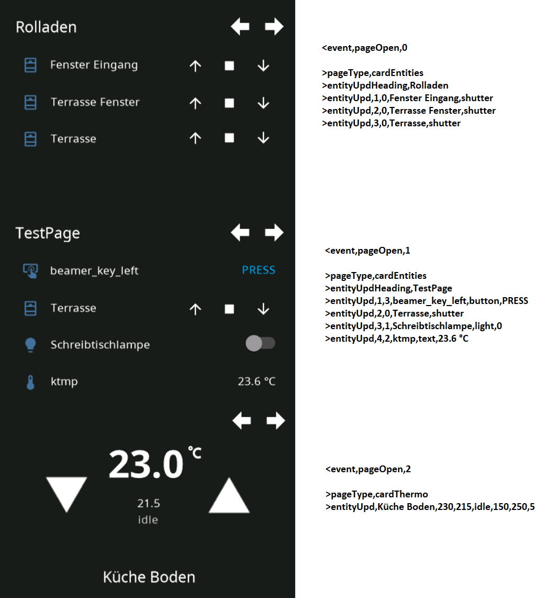

# NSPanel Lovelance UI

The general idea is that the Nextion Display cycles though a page counter and the esp32 tells the display what to do.
If you are changeing the page the nextion display will send and event to the esp32 and it has to answer with the messages~ that will update the current page with it's desired components. This enables easy changes~ without touching the HMI Project.

# Message Flow

HomeAssistant / NodeRed -- MQTT -- Tasmota -- Nextion Screen

See the following picture to get an Idea for the messages send and recived from the screen during cycling though pages. Please note that the messages in the picutre are outdated, but it is still useful to understand the concept.




# Custom Protocol
```
55 BB [payload length] [payload length] [payload] [crc] [crc]
```

Payload length contains the number of bytes of the payload.

CRC is "CRC-16 (MODBUS) Big Endian" calculated over the whole message

This protocol does not try to implement broken JSON Commands with a specified type (lol).
Instead the commands are plain text commands with parameters.

## Example for valid Message
This message has to be generated for the Message "1337" (1337 is not a valid command~ this is just an example)
```
55 BB  04 00  31 33 33 37  5F 5B
```
## Messages to Nextion Display

The following message should be implemented on all pages

wake screen:

`wake`

set brightness of screensaver and active-brightness:

`dimmode~0~100 - (screen off)`

`dimmode~100~100 - (screen on with full brightness)`

set current time:

`time~22 : 26`

set current date:

`date~Di 24. Februar`

set screensaver timeout (set time in sec~ max 65):

`timeout~15 - timeout after 15 seconds`

`timeout~0 - disable screensaver`

change the page type:

`pageType~pageStartup`

`pageType~cardEntities`

`pageType~cardThermo`

`pageType~cardMedia`

`pageType~popupLight~Schreibtischlampe~light.schreibtischlampe`

`pageType~popupNotify`

`pageType~screensaver`

### screensaver page

`weatherUpdate~tMainIcon~tMainText~tForecast1~tF1Icon~tForecast1Val~tForecast2~tF2Icon~tForecast2Val~tForecast3~tF3Icon~tForecast3Val~tForecast4~tF4Icon~tForecast4Val~optionalLayoutIcon~optionalLayoutText`

`color~background~time~timeAMPM~date~tMainIcon~tMainText~tForecast1~tForecast2~tForecast3~tForecast4~tF1Icon~tF2Icon~tF3Icon~tF4Icon~tForecast1Val~tForecast2Val~tForecast3Val~tForecast4Val~bar~tMRIcon~tMR`

`notify~heading~text`

### cardEntities Page

The following message can be used to update the content on the cardEntities Page

`entityUpd~heading~navigation~[~*type*~*internalNameEntity*~*iconId*~*iconColor*~*displayNameEntity*~*optionalValue*]x4`

`~light~light.entityName~1~17299~Light1~0`

`~shutter~cover.entityName~0~17299~Shutter2~iconUp|iconStop|iconDown`

`~delete~~~~~`

`~text~sensor.entityName~3~17299~Temperature~content`

`~button~button.entityName~3~17299~bt-name~bt-text`

`~switch~switch.entityName~4~17299~Switch1~0`

`~number~input_number.entityName~4~17299~Number123~value|min|max`

### popupLight Page

`entityUpdateDetail~entityName~*ignored*~*iconColor*~*buttonState*~*sliderBrightnessPos*~*sliderColorTempPos*~*colorMode*~*color_translation*~*color_temp_translation*~*brightness_translation*`

`entityUpdateDetail~1~17299~1~100~78~enable`

`entityUpdateDetail~1~17299~1~100~disable`

### popupShutter Page

`entityUpdateDetail~entityName~*sliderPos*~2ndrow~textPosition~icon1~iconUp~iconStop~iconDown~iconUpStatus~iconStopStatus~iconDownStatus~textTilt~iconTiltLeft~iconTiltStop~iconTiltRight~iconTiltLeftStatus~iconTiltStopStatus~iconTiltLeftStatus~tiltPos`

`entityUpdateDetail~1~77`

### popupNotify Page

`entityUpdateDetail~*internalName*~*tHeading*~*tHeadingColor*~*b1*~*tB1Color*~*b2*~*tB2Color*~*tText*~*tTextColor*~*sleepTimeout*`

`exitPopup`

### cardThermo Page

`entityUpd~*heading*~*navigation*~*internalNameEntiy*~*currentTemp*~*destTemp*~*status*~*minTemp*~*maxTemp*~*stepTemp*[[~*iconId*~*activeColor*~*state*~*hvac_action*]]~tCurTempLbl~tStateLbl~tALbl~iconTemperature~dstTempTwoTempMode`

`[[]]` are not part of the command~ this part repeats 8 times for the buttons

### cardMedia Page

onoffbtn has to be`disable` to disable the on off btn
tIconBtnEntityName is the entiy name used in the button event for pressing the upper left icon

`entityUpd~*heading*~*navigation*~*internalNameEntiy*~*icon*~*title*~*author*~*volume*~*playpauseicon*~currentSpeaker~speakerList-seperated-by-?~onoffbtn~tIconBtnEntityName`

### cardAlarm Page

`entityUpd~*internalNameEntity*~*navigation*~*arm1*~*arm1ActionName*~*arm2*~*arm2ActionName*~*arm3*~*arm3ActionName*~*arm4*~*arm4ActionName*~*icon*~*iconcolor*~*numpadStatus*~*flashing*`

### cardQR Page

`entityUpd~heading~navigation~textQR[~type~internalName~iconId~displayName~optionalValue]x2`

### cardPower Page

`entityUpd~heading~navigation~colorHome~iconHome~textHome[~iconColor~icon~speed~valueDown]x6`

`entityUpd~test~1|1~6666~A~hu~8888~B~1~t0u~9999~C~2~t1u~1111~D~3~t2u~33333~E~-1~t3u~3333~F~-2~t4u~4444~G~-3~t5u`

## Messages from Nextion Display

`event,buttonPress2,pageName,bNext`

`event,buttonPress2,pageName,bPrev`

`event,buttonPress2,pageName,bExit,number_of_taps`

`event,buttonPress2,pageName,sleepReached`


### startup page

`event,startup,version,model`

### screensaver page

`event,buttonPress2,screensaver,exit` - Touch Event on Screensaver

`event,screensaverOpen` - Screensaver has opened


### cardEntities Page

`event,*eventName*,*entityName*,*actionName*,*optionalValue*`

`event,buttonPress2,internalNameEntity,up`

`event,buttonPress2,internalNameEntity,down`

`event,buttonPress2,internalNameEntity,stop`

`event,buttonPress2,internalNameEntity,OnOff,1`

`event,buttonPress2,internalNameEntity,button`

### popupLight Page

`event,pageOpenDetail,popupLight,internalNameEntity`

`event,buttonPress2,internalNameEntity,OnOff,1`

`event,buttonPress2,internalNameEntity,brightnessSlider,50`

`event,buttonPress2,internalNameEntity,colorTempSlider,50`

`event,buttonPress2,internalNameEntity,colorWheel,x|y|wh`

### popupShutter Page

`event,pageOpenDetail,popupShutter,internalNameEntity`

`event,buttonPress2,internalNameEntity,positionSlider,50`

### popupNotify Page

`event,buttonPress2,*internalName*,notifyAction,yes`

`event,buttonPress2,*internalName*,notifyAction,no`

### cardThermo Page

`event,buttonPress2,*entityName*,tempUpd,*temperature*`

`event,buttonPress2,*entityName*,hvac_action,*hvac_action*`

### cardMedia Page

`event,buttonPress2,internalNameEntity,media-back`

`event,buttonPress2,internalNameEntity,media-pause`

`event,buttonPress2,internalNameEntity,media-next`

`event,buttonPress2,internalNameEntity,volumeSlider,75`

### cardAlarm Page

`event,buttonPress2,internalNameEntity,actionName,code`


# Design Guidelines for Nextion HMI Project

Background Color is 
- RGB565: 6371 [18e3] (HEX: #1C1C1C, RGB: 28,28,28)

Source for Icons is the Material Design Font, used by HASPone
https://github.com/HASwitchPlate/HASPone
