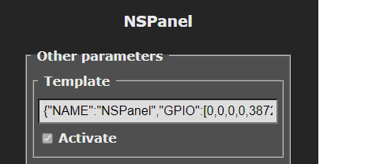

# Flash Tasmota to your NSPanel

You need to connect to your nspanel via serial and flash tasmtoa [tasmota32-nspanel.bin](http://ota.tasmota.com/tasmota32/release/tasmota32-nspanel.bin) to your NSPanel. 
You can use the Tasmota Web Installer to do so. [Tasmota Web Installer](https://tasmota.github.io/install/)

Checkout Blakadders Template Repo for more information on flashing, do not use the autoexec.be from this page.
[NSPanel Page of the Tasmota Template Repository](https://templates.blakadder.com/sonoff_NSPanel.html)

## Configure Tasmota Template for NSPanel

Configure the NSPanel template for Tasmota. (Go to Configuration and Configure Other and paste the template there, make sure to tick the activate checkbox)

You can use the following template or copy the one on the [Tasmota Template Repo Site](https://templates.blakadder.com/sonoff_NSPanel.html).

`{"NAME":"NSPanel","GPIO":[0,0,0,0,3872,0,0,0,0,0,32,0,0,0,0,225,0,480,224,1,0,0,0,33,0,0,0,0,0,0,0,0,0,0,4736,0],"FLAG":0,"BASE":1,"CMND":"ADCParam 2,11200,10000,3950 | Sleep 0 | BuzzerPWM 1"}`

After a reboot of tasmota your screen will light up with the stock display firmware.

## Upload Berry Driver to Tasmota

1. Download the autoexec.be from the repository: [Berry Driver](https://github.com/joBr99/nspanel-lovelace-ui/blob/main/tasmota/autoexec.be)

2. Go to `Consoles` > `Manage File System` in Tasmota and upload the previously downloaded file.

3. Restart your NSPanel

## Flash Firmware to Nextion Screen

Due the limitations of Berry, it's not possible to download the tft file directly from github, so I'm also renting a small server where you can download the file via HTTP.

Use the one following commands to flash the latest release from this repository, just execute the following Command in Tasmota:

EU Version: `FlashNextion http://nspanel.pky.eu/lui-release.tft`

US Version Portrait: `FlashNextion http://nspanel.pky.eu/lui-us-p-release.tft`

US Version Landscape: `FlashNextion http://nspanel.pky.eu/lui-us-l-release.tft`

Alternatively you can use your own webserver or the one build into HomeAssistant:

 
Upload the nspanel.tft from the lastest release to a Webserver and execute the following command in Tasmota Console.

**Webserver must be HTTP, HTTPS is not supported, due to limitations of berry lang on tasmota**

`FlashNextion http://ip-address-of-your-webserver:8123/local/nspanel.tft`

